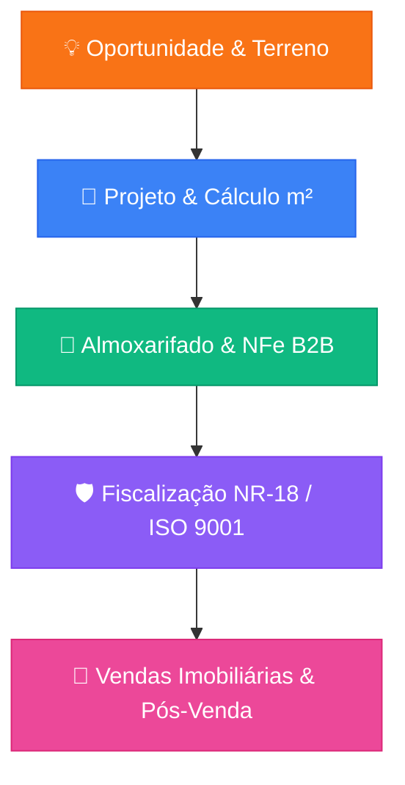

# 01. VISÃO, MOTIVAÇÃO E JUSTIFICATIVA DO PROJETO OBRA360

**Instituição**: AESA-CESA (2026)  
**Projeto**: Obra360 - Ecossistema Digital Integrado B2B/B2C para a Construção Civil  
**Autores**: João Pedro e Marcos Henrique  
**Professor Orientador**: Dennys Carvalho  

---

## 1. Contexto do Setor da Construção Civil

O setor da construção civil é um dos pilares mais relevantes da economia mundial, representando uma parcela expressiva do PIB global. Contudo, historicamente enfrenta sérios problemas estruturais:

- **Fragmentação Operacional**: Falta de integração entre construtoras, escritórios de arquitetura, almoxarifados de canteiro, fornecedores de materiais e clientes finais.
- **Desperdício e Retrabalho**: Estimativas indicam que até 30% dos materiais de construção são desperdiçados por erros de cálculo, falta de controle de estoque ou falhas de planejamento.
- **Atrasos e Estouro de Orçamento**: A ausência de sincronização em tempo real entre o cronograma físico-financeiro (WBS) e as compras gera atrasos recorrentes nas entregas de empreendimentos.
- **Falta de Transparência para o Cliente**: Compradores de imóveis e investidores raramente têm acesso a informações atualizadas sobre a evolução real de suas obras.

---

## 2. Por que o Obra360 Nasceu? (A Proposta de Valor)

O **Obra360** foi concebido como uma **Plataforma Corporativa Web e Ecossistema Digital Integrado (SaaS Multi-Tenant B2B/B2C)** projetado para unificar todo o ciclo de vida de um empreendimento imobiliário e habitacional.

A solução atua desde a viabilidade de terrenos, passando pelo planejamento de cronograma físico-financeiro (WBS), cálculo automatizado de insumos por metro quadrado ($m^2$), cotações B2B por chave de Nota Fiscal Eletrônica (NFe de 44 dígitos), fiscalização de segurança NR-18 e ISO 9001, até a comercialização de unidades imobiliárias e pós-venda.

---

## 3. Justificativa Técnica e Acadêmica

### 3.1. Relevância Científica e Tecnológica
O Obra360 demonstra a aplicação prática dos conceitos mais avançados da Engenharia de Software Moderna:
- **Clean Architecture & DDD (Domain-Driven Design)**: Separação rigorosa das regras de negócio em relação aos frameworks externos.
- **Arquitetura Orientada a Eventos (Event-Driven & Microservices)**: Uso de barramentos de mensageria assíncrona (**Apache Kafka** e **RabbitMQ**) combinados com o **Transactional Outbox Pattern** para garantir consistência eventual e resiliência.
- **Multi-Tenancy e Segurança RBAC**: Suporte nativo a isolamento de dados por organização e controle de acesso baseado em 13 papéis corporativos (*Role-Based Access Control*).

### 3.2. Impacto Socioeconômico
Ao automatizar a cotação B2B por chave NFe de 44 dígitos e o cálculo preciso de materiais por metragem ($m^2$), a plataforma reduz o custo operacional de insumos estruturais (cimento, aço, areia, tijolos), promovendo sustentabilidade ambiental e eficiência financeira.
