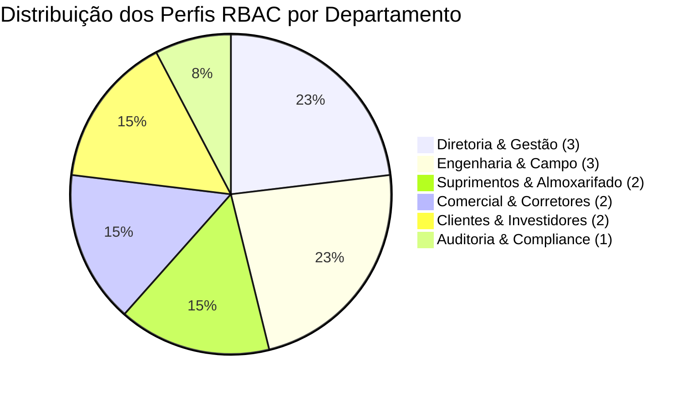

# 02. REQUISITOS E REGRAS DE NEGÓCIO DO PROJETO OBRA360

---

## 1. Requisitos Funcionais (RF)

| ID | Nome do Requisito | Descrição Detalhada |
| :--- | :--- | :--- |
| **RF-01** | Gestão Multi-Tenant de Organizações | Permitir o cadastro, edição e isolamento de dados de construtoras, incorporadoras e fornecedores B2B. |
| **RF-02** | Autenticação RBAC por Papel | Restringir funcionalidades do sistema com base em 13 perfis hierárquicos de acesso. |
| **RF-03** | Cálculo Automático por $m^2$ | Calcular estimativa exata de sacos de cimento, kg de aço, tijolos, areia e brita com base na área em $m^2$. |
| **RF-04** | Gestão de Almoxarifado & Estoque | Controlar entrada/saída de materiais com alerta de Estoque Mínimo Crítico. |
| **RF-05** | Validação Fiscal de NFe | Validar chaves de acesso de Nota Fiscal Eletrônica de 44 dígitos numéricos nos padrões SEFAZ. |
| **RF-06** | Cotações B2B (RFQ) | Permitir abertura de cotações de insumos e comparação de preços entre fornecedores parceiros. |
| **RF-07** | Locação de Frotas Pesadas | Módulo para reserva e cotação de escavadeiras, guindastes e tratores de esteira. |
| **RF-08** | Registro de Ocorrências NR-18 / ISO 9001 | Cadastrar não-conformidades técnicas no canteiro com fotos, nível de severidade e responsável. |
| **RF-09** | Portal de Vendas Imobiliárias | Vitrine de unidades habitacionais (casas/apartamentos) para corretores e clientes finais. |
| **RF-10** | Canal de Pós-Venda & Garantia | Abertura de chamados de assistência técnica pós-entrega com fotos e status de resolução. |
| **RF-11** | Painel do Investidor Imobiliário | Visualização do aporte financeiro, ROE e avanço físico-financeiro da obra. |
| **RF-12** | Chat Corporativo em Tempo Real | Comunicação interna com suporte a anexos técnicos entre residentes de obra e compras. |
| **RF-13** | Trilha de Auditoria Imutável | Registro auditável em formato JSON de todas as movimentações e acessos. |
| **RF-14** | Exportação de Relatórios PDF/CSV | Geração automatizada de relatórios executivos formatados para impressão ou análise. |
| **RF-15** | PWA Offline com Sincronização Assíncrona | Funcionamento em canteiros sem sinal de internet com sincronização ao reconectar. |
| **RF-16** | Streaming de Eventos Kafka/RabbitMQ | Publicação assíncrona de eventos de domínio quando o estoque atinge o nível crítico. |
| **RF-17** | Módulo de Gestão de Cronograma WBS | Acompanhamento de etapas construtivas (Fundação, Alvenaria, Instalações, Acabamento). |

---

## 2. Requisitos Não-Funcionais (RNF)

| ID | Categoria | Descrição / Meta de Qualidade |
| :--- | :--- | :--- |
| **RNF-01** | **Desempenho** | O tempo de resposta das APIs REST deve ser inferior a 200 milissegundos no percentil 95. |
| **RNF-02** | **Arquitetura** | O backend deve seguir estritamente a Clean Architecture em 4 camadas e DDD. |
| **RNF-03** | **Segurança** | Criptografia de dados sensíveis em trânsito (TLS 1.3) e conformidade com LGPD. |
| **RNF-04** | **Disponibilidade** | O sistema deve manter alta disponibilidade (SLA de 99.9%) operando em containers Docker. |
| **RNF-05** | **Compatibilidade** | O frontend deve ser um Progressive Web App (PWA) responsivo adaptável a mobile, tablet e desktop. |
| **RNF-06** | **Usabilidade** | A interface gráfica deve utilizar o padrão de design minimalista corporativo (Padrão Vercel/Apple). |
| **RNF-07** | **Auditabilidade** | Todas as alterações de estado do banco transacional devem gerar registros na tabela `tb_outbox_events`. |
| **RNF-08** | **Extensibilidade** | Uso de Design Patterns (Factory, Strategy, Builder) para permitir adicionar novos módulos sem refatorar o core. |

---

## 3. Tabela de Matriz de Perfis RBAC (13 Papéis)

---

## 4. Principais Regras de Negócio (RN)

- **RN-01 (Estoque Crítico)**: Quando a quantidade de um item de estoque for menor ou igual ao `minStock`, o sistema dispara obrigatoriamente um evento de domínio no barramento Apache Kafka.
- **RN-02 (Validação NFe)**: Uma chave de Nota Fiscal Eletrônica só é aceita se contiver exatamente 44 dígitos numéricos validados pela estratégia `SefazNfeValidationStrategy`.
- **RN-03 (Isolamento Multi-Tenant)**: Usuários de uma empresa `CMP-XXX` não podem visualizar orçamentos ou estoques de outra empresa `CMP-YYY`.
- **RN-04 (Garantia de Entrega Outbox)**: Eventos assíncronos não devem ser perdidos em caso de queda de rede; devem ser gravados primeiro na tabela `tb_outbox_events`.
