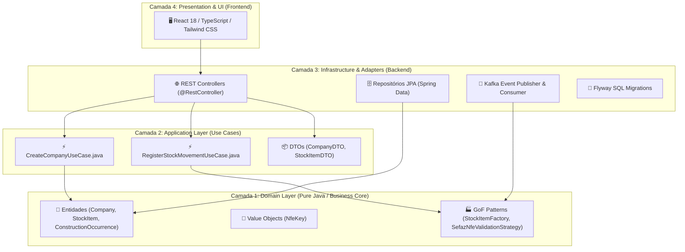
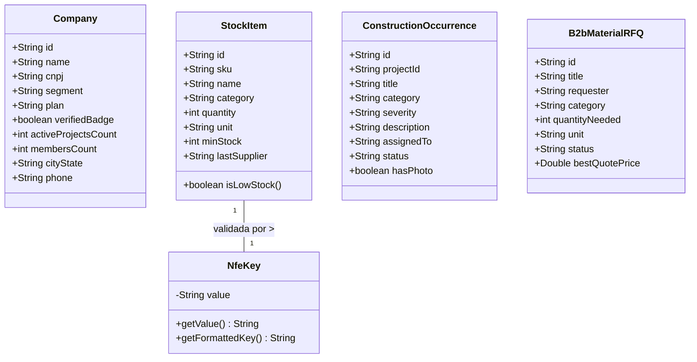
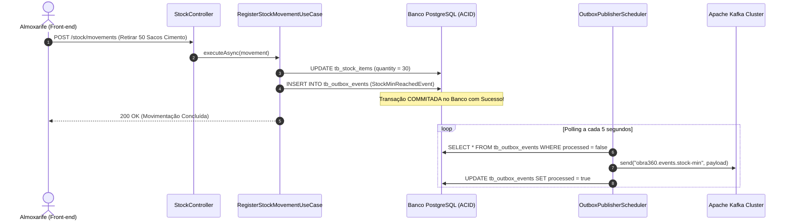

# 03. ARQUITETURA TÉCNICA, DIAGRAMAS UML E DESIGN PATTERNS

---

## 1. Visão Geral da Arquitetura (Clean Architecture em 4 Camadas)

O Obra360 adota a **Clean Architecture** dividindo a aplicação em círculos concêntricos de responsabilidade, onde as dependências apontam estritamente para dentro:



---

## 2. Diagrama de Classes UML (Modelos de Domínio DDD)



---

## 3. Diagrama de Casos de Uso UML (Use Cases)

```mermaid
usecaseDiagram
    actor "Engenheiro Residente" as Eng
    actor "Almoxarife de Canteiro" as Alm
    actor "Gerente de Compras B2B" as Com
    actor "Diretoria Corporativa" as Dir

    rectangle "Plataforma Obra360" {
        usecase "UC-01: Cadastrar Organização Multi-Tenant" as UC1
        usecase "UC-02: Registrar Movimentação de Estoque NFe" as UC2
        usecase "UC-03: Disparar Alerta de Estoque Mínimo" as UC3
        usecase "UC-04: Calcular Insumos por m²" as UC4
        usecase "UC-05: Abrir Cotação B2B (RFQ)" as UC5
        usecase "UC-06: Cadastrar Ocorrência NR-18 / ISO 9001" as UC6
        usecase "UC-07: Gerar Relatório Executivo PDF" as UC7
    }

    Dir --> UC1
    Dir --> UC7
    Alm --> UC2
    UC2 ..> UC3 : <<include>>
    Eng --> UC4
    Eng --> UC6
    Com --> UC5
```

---

## 4. Diagrama de Sequência Assíncrono (Outbox Pattern + Kafka)



---

## 5. Catálogo de Design Patterns GoF Aplicados

| Pattern | Classificacão | Aplicação Prática no Projeto |
| :--- | :--- | :--- |
| **Factory Method** | Criacional | `StockItemFactory.java` - Encapsula a criação de insumos por categoria e limiares críticos. |
| **Strategy Pattern** | Comportamental | `SefazNfeValidationStrategy.java` e `materialCalculatorStrategy.ts` - Estratégias de validação fiscal NFe e cálculo de materiais $m^2$. |
| **Builder Pattern** | Criacional | `CompanyBuilder.java` - API fluente para construção de instâncias da entidade `Company`. |
| **DTO Pattern** | Estrutural | `CompanyDTO.java` e `StockItemDTO.java` - Transfere dados validados entre as camadas da API. |
| **Outbox Pattern** | Arquitetural | `OutboxEventJpaEntity.java` e `OutboxPublisherScheduler.java` - Garantia de entrega assíncrona de eventos. |
