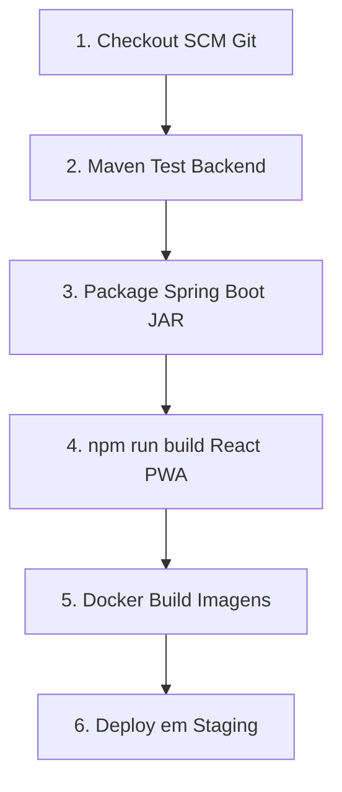

# ⚙️ GUIA DE INTEGRAÇÃO JENKINS CI/CD - OBRA360

Este guia explica como integrar o **Jenkins** (servidor de automação CI/CD) ao projeto **Obra360**, garantindo que cada `git push` no GitHub execute testes automáticos, compilação do Spring Boot, build do React e publicação Docker.

---

## 🎯 POR QUE USAR JENKINS NO OBRA360?

1. **Automação de Testes (Continuous Integration - CI):** Toda alteração de código roda os testes do Java (`mvn test`) e verifica se quebrou alguma regra do canteiro.
2. **Garantia de Qualidade:** Não deixa subir código com erros no frontend (`npm run build`).
3. **Publicação Contínua (Continuous Deployment - CD):** Gera imagens Docker prontas para implantação em nuvem (AWS / GCP / Docker Compose).

---

## 📋 PASSO A PASSO PARA CONFIGURAR O JENKINS:

### 🔹 **Passo 1: Instalar o Jenkins (via Docker)**
Se você não tem o Jenkins instalado, rode no terminal:
```bash
docker run -d --name jenkins -p 8080:8080 -p 50000:50000 -v jenkins_home:/var/jenkins_home jenkins/jenkins:lts-jdk21
```
Acesse o Jenkins pelo navegador: 👉 **`http://localhost:8080`**.

---

### 🔹 **Passo 2: Instalar os Plugins Necessários no Jenkins**
No painel do Jenkins (*Gerenciar Jenkins -> Plugins*), instale:
- **Git Plugin**
- **Pipeline Plugin**
- **Maven Integration Plugin**
- **NodeJS Plugin**
- **Docker Pipeline Plugin**

---

### 🔹 **Passo 3: Criar um Novo Pipeline no Jenkins**
1. Na tela inicial do Jenkins, clique em **`Novo Job`**.
2. Digite o nome: **`Obra360-CI-CD-Pipeline`**.
3. Selecione a opção **`Pipeline`** e clique em **OK**.
4. Na seção **Pipeline**:
   - Defina a definição como: **`Pipeline script from SCM`**.
   - SCM: **`Git`**.
   - Repository URL: `https://github.com/JPedro01x/obra-360.git`
   - Branch: `*/main`
   - Script Path: **`Jenkinsfile`**
5. Clique em **Salvar**.

---

### 🔹 **Passo 4: Configurar o Webhook no GitHub (Automação por Push)**
1. Abra seu repositório no GitHub: `https://github.com/JPedro01x/obra-360`.
2. Vá em **Settings -> Webhooks -> Add webhook**.
3. Payload URL: `http://seu-servidor-jenkins:8080/github-webhook/`
4. Content type: `application/json`
5. Clique em **Add webhook**.

---

## ⚙️ FLUXO DE EXECUÇÃO DO `Jenkinsfile` (6 ESTÁGIOS):



---

## 🧪 COMO TESTAR O PIPELINE:
1. No painel do Jenkins, clique em **`Construir Agora` (Build Now)**.
2. O Jenkins executará todas as 6 etapas automaticamente, gerando relatórios de testes JUnit e artefatos de produção!
