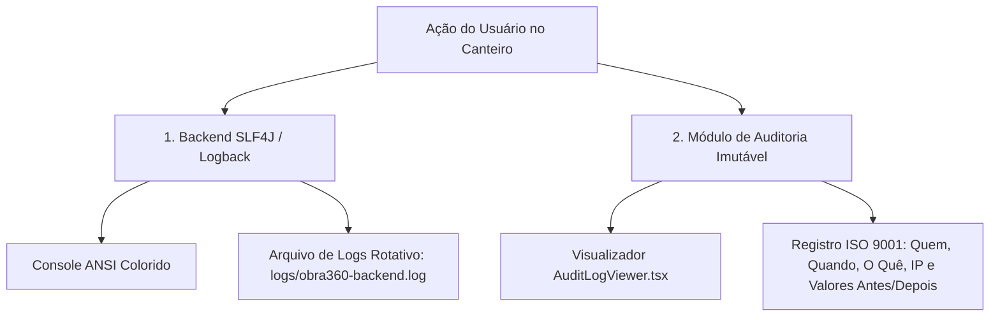

# 📜 SISTEMA DE LOGS & AUDITORIA - OBRA360

O **Obra360** implementa um **Sistema Duplo de Log & Auditoria Imutável (Enterprise Audit System)** para atender aos rigorosos requisitos de rastreabilidade de obras e conformidade com a norma **ISO 9001**.

---

## 🏗️ ARQUITETURA DE LOGS EM 2 CAMADAS:

---

## 🔹 CAMADA 1: LOGS DE INFRAESTRUTURA & BACKEND (Logback + SLF4J)
- **Arquivo de Configuração:** [`backend/src/main/resources/logback-spring.xml`](file:///c:/Users/Jo%C3%A3o%20Pedro/Downloads/claude/backend/src/main/resources/logback-spring.xml)
- **Recursos Principais:**
  - **Console ANSI Colorido:** Destaca erros (`ERROR` em vermelho), avisos (`WARN` em amarelo) e eventos normais (`INFO` em azul/verde).
  - **Rolling File Appender (`logs/obra360-backend.log`):** Grava logs diariamente em arquivo com rotação automática ao atingir 10MB (compactação `.gz`).
  - **Retenção de 30 Dias:** Mantém o histórico de execução por 30 dias para auditoria de TI.
  - **Rastreio de SQL Hibernate:** Exibe as queries SQL executadas no banco relacional.

---

## 🔹 CAMADA 2: LOGS DE AUDITORIA DE NEGÓCIO & COMPLIANCE (ISO 9001)
- **Componente Visual:** [`src/components/AuditLogViewer.tsx`](file:///c:/Users/Jo%C3%A3o%20Pedro/Downloads/claude/src/components/AuditLogViewer.tsx)
- **Recursos Principais:**
  - **Imutabilidade:** Registra cada alteração no canteiro de obras sem permitir deleção ou alteração retroativa.
  - **Rastreabilidade de 6 Fatores:**
    1. **Identificador Único (`LOG-8801`)**
    2. **Carimbo de Data e Hora (`Timestamp`)**
    3. **Usuário Responsável (`E-mail e Perfil RBAC`)**
    4. **Endereço IP de Origem**
    5. **Ação Realizada** (ex: `UPDATE_STAGE_PROGRESS`, `STOCK_ENTRY`)
    6. **Comparativo de Valores (`OldValue` vs `NewValue`)**

---

## 🧪 COMO VISUALIZAR OS LOGS NO PROJETO:

### 1. **Visualizar Logs do Backend (Terminal / Arquivo):**
- Os logs do backend Java ficam salvos no diretório `./backend/logs/obra360-backend.log`.

### 2. **Visualizar Logs de Auditoria de Negócio (Tela do Sistema):**
- Logado como `SUPER_ADMIN` ou `AUDITOR`, acesse a aba **Auditoria & Compliance** para navegar na tabela imutável de eventos.
